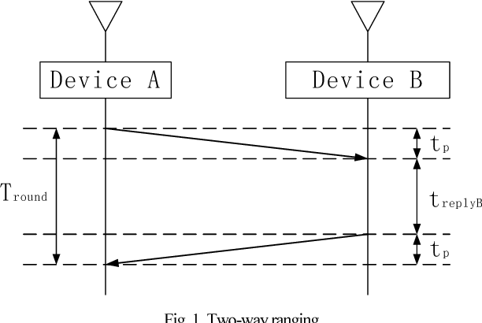

# NRF-Applications-Including-a-ranging-system
 [NRF technologie] First steps using NRF24L+ modules 

**> A basic "Hello World" communication on Half-duplex message between two nodes**  

**> Computing the distance separing two nodes**  
 - Method 1 : using the one way ranging (OWR) technique and a straight forward explanation on it's limitation. 
 - Method 2 : using the two way ranging (TWR) technique. it's a request/responde comunication over a pre-configured pipe supporting Full-duplex transmission.

# Curent tests:

Am curently trying to include freeRtos functionalities to provide more effeciency in termms of delays to ensure correct calculation and to monitore variants tasks.

